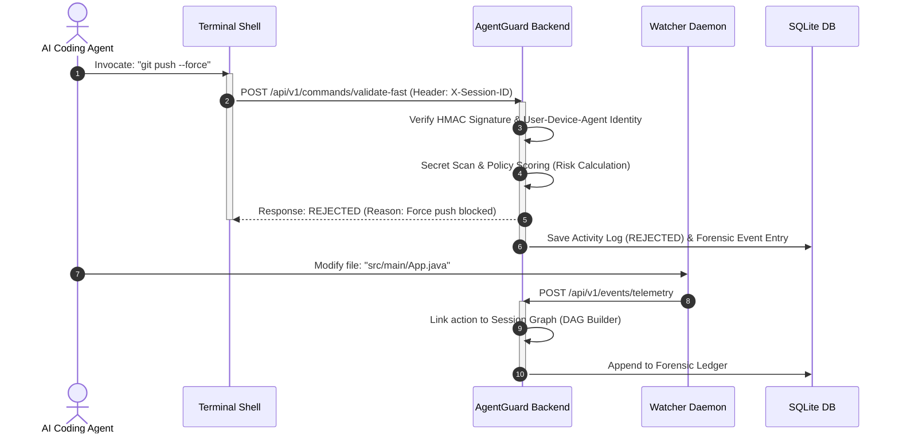

# AgentGuard AI: Governance and Security Observability Platform for Autonomous Coding Agents

AgentGuard AI is a local-first runtime governance and security observability platform designed to supervise, intercept, and audit actions executed by autonomous AI coding agents (such as Cursor, Windsurf, or Claude Code) and developer terminals. It provides real-time policy enforcement, risk scoring, intent correlation, and forensic auditing via a high-performance Java backend and a lightweight dashboard.

---

## 1. Core Problem & Objective

The integration of autonomous AI agents into software development workflows introduces critical security vectors. IDE-integrated agents and CLI executors operate with high-privilege access, generating and running terminal commands, installing dependencies, and mutating file systems directly. Without dedicated guardrails, these systems expose organizations to:
* Destructive terminal commands (e.g., recursive file deletion, database drops).
* High-entropy secret and credential exposure (e.g., committing API keys, certificates).
* Lack of causal attribution (inability to map a high-level LLM prompt to the resulting low-level terminal executions and disk writes).

AgentGuard AI was engineered to address these challenges. It establishes a local governance boundary that monitors file changes and intercept command invocations, performs sub-millisecond policy validation, correlates developer prompts to execution chains, and logs events into an append-only database to ensure compliance and traceability.

---

## 2. System Architecture & Components

AgentGuard AI is structured as a decoupled, local-first runtime monitoring suite:

```mermaid
graph TD
    subgraph Developer Host
        Trap[Shell Trap & Shim]
        Watcher[Watcher Daemon]
        Dashboard[Web Dashboard]
        
        subgraph Core Engine [Spring Boot Core Backend]
            Policy[Policy Engine]
            Tracker[Identity Tracker]
            Graph[Causal Graph Service]
            Forensic[Forensic Event Store]
        end
        
        DB[(SQLite Ledger)]
    end
    
    Trap -->|1. Intercept & Validate| Policy
    Watcher -->|2. Async Telemetry| Graph
    Policy -->|3. Record Event| Forensic
    Graph -->|4. Link Event| Forensic
    Forensic -->|5. JPA Pre-Hooks| DB
    Dashboard -->|6. Query Stats & Logs| Core Engine
```

### Core Components

* **Shell Hook & Command Shim**: Evaluates execution requests at the shell level. Uses a `DEBUG` trap wrapper to intercept commands prior to execution, querying the backend validation controller synchronously to block, allow, or flag the command.
* **Watcher Daemon**: A background Node.js process using Chokidar to monitor directory trees. It captures file system events (`CREATE`, `MODIFY`, `DELETE`), debounces rapid change bursts, and routes async telemetry reports to the backend.
* **Spring Boot Core Backend**:
  * **Policy Engine**: A multi-factor evaluation engine that combines deterministic regex rules with contextual indicators (e.g., protected branch name presence, file extensions, behavioral anomalies) to yield a weighted risk score (0-100).
  * **Agent Identity Tracker**: Implements a three-layer identity model resolving the executing agent type (Terminal User, IDE Agent, or Background Daemon) and calculates dynamic trust decay scores.
  * **Prompt-to-Action Correlation Engine**: Merges active session contexts with execution telemetry. Utilizes LLM narrative enrichments to explain how raw command chains correlate back to the user's high-level instructions.
  * **Execution Graph Builder**: Constructs directed acyclic causal graphs mapping Prompt -> Command -> File Modification. Consolidates noisy, concurrent write streams into clustered nodes to preserve graph read integrity.
  * **Forensic Event Store**: Manages database persistence. Utilizes SQLite for local-first storage, hardened with application-level hooks to block out-of-band record updates or deletions.

---

## 3. Data Flow & Security Model

### Event Telemetry Pipeline



1. **Command Interception**: The shell trap catches a command (e.g., `git push --force`). It appends the local cryptographic session token and issues a synchronous POST request to `/api/v1/commands/validate-fast`.
2. **Identity Authentication**: The token is validated using HMAC-SHA256. The server extracts the `User-Device-Agent` composite identifier. If signature validation fails, execution is blocked immediately.
3. **Secret Scan (Secret Sentinel)**: The command string is scanned for high-entropy structures (Stripe keys, AWS tokens, private certs). If detected, validation aborts instantly, logging a high-risk infraction.
4. **Policy Engine Score**: The engine evaluates the command risk based on deterministic rules and context. The final risk score is computed:
   $$\text{Risk} = \text{BaseRuleRisk}(40\%) + \text{ContextRisk}(40\%) + \text{AnomalyRisk}(20\%) - \text{TrustAdjustment}$$
5. **Decision & Response**: Based on the governance profile (`CONSERVATIVE`, `BALANCED`, or `AGGRESSIVE`), the system outputs `APPROVED`, `REVIEW`, or `REJECTED`. The decision is returned to the shell trap in under 10ms.
6. **Asynchronous Telemetry Correlation**: Simultaneously, the Node.js watcher daemon detects corresponding file changes, queues them, and dispatches them asynchronously to `/api/v1/events/telemetry`. The correlation engine links the files to the parent command based on timestamp windows and session ID.

### Cryptographic Security Model

Sessions are established via a composite token mapping format:
$$\text{Token} = \text{Base64}(\text{user\_id} : \text{device\_id} : \text{agent\_id}) \ . \ \text{Base64}(\text{HMAC-SHA256}(\text{payload}, \text{secret}))$$

The backend uses a cryptographically secure runtime key to sign the token. This prevents agents from spoofing identity parameters or bypassing validation shims using fake session headers.

---

## 4. Performance & High-Availability Configurations

To operate locally without causing input lag in the developer's terminal, the system uses several optimizations:

* **Synchronous Fast-Path / Asynchronous Slow-Path**: High-latency operations (such as AI-driven explainability runs, compliance grades, and directory scanning) are offloaded to background threads. The command validation path remains synchronous and lightweight, resolving in less than 10 milliseconds.
* **Non-Blocking Telemetry Ingestion**: Telemetry logs are buffered using a thread-safe `LinkedBlockingQueue` and flushed to the SQLite disk store in batched transactions every 1 second, avoiding database lock contentions.
* **Watcher Event Debouncing**: Rapid file change bursts (common during compilation or dependency resolution) are debounced using a 300ms window to prevent telemetry ingestion bottlenecks.

---

## 5. Architectural Tradeoffs & System Constraints

Designing AgentGuard AI for local-first execution involves several engineering tradeoffs:

### A. Local SQLite vs. Distributed Storage
* **Tradeoff**: SQLite provides zero-dependency, zero-configuration local storage. However, it operates on a single-writer lock model.
* **Limitation**: While suitable for single-developer environments, concurrent telemetry logs can cause write contention under heavy load. High-throughput multi-user setups require swapping the persistence layer to PostgreSQL via the provided datasource configurations.

### B. Interception Latency vs. Analysis Depth
* **Tradeoff**: Restricting command validation latency to under 10ms limits the platform to heuristic and deterministic analysis on the fast-path.
* **Limitation**: Complex semantic or LLM-based policy evaluation cannot run synchronously within the terminal interaction loop. Therefore, advanced analysis is handled as an asynchronous "slow-path" check that triggers alerts retroactively.

### C. Shell Hook Reliability & Bypass Vectors
* **Tradeoff**: Using a shell trap (`DEBUG`) is lightweight and requires no kernel-level modules or root privileges.
* **Limitation**: This is an advisory monitor rather than strict sandbox containment. Users or agents can bypass shell hooks by running custom compiled binaries, invoking direct syscalls, or executing commands through nested zsh/bash sessions started with `--noprofile`. True sandbox containment requires kernel-level hook architectures (e.g., eBPF or auditing daemons).

### D. Cost & Latency of AI Explainability
* **Tradeoff**: Integrating Ollama or Gemini models provides human-readable context audits.
* **Limitation**: AI inference is resource-intensive and slow. The platform mitigates this by making all AI calls non-blocking and optional, ensuring that offline or network-throttled states fallback gracefully to deterministic metrics.
